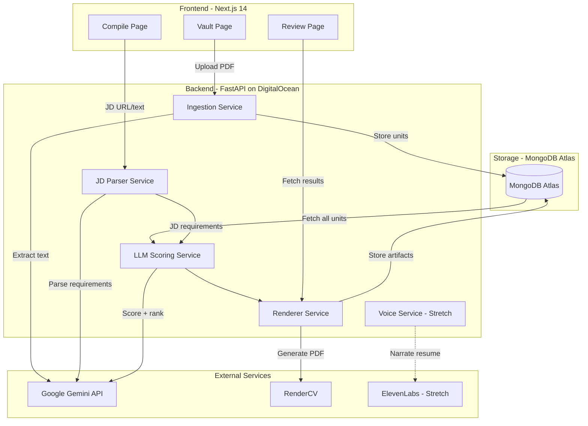
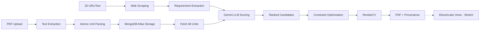

# ResMatch - Product Requirements Document

## 1. Header and Meta Information

| Field | Value |
|-------|-------|
| **Title** | ResMatch Truth-First Resume Engine |
| **Author** | Derek |
| **Status** | Draft |
| **Last Updated** | January 24, 2026 |
| **Version** | 1.1 |
| **Event** | SwampHacks XI Hackathon |

---

## 2. Hackathon Challenge Targets

### Primary Challenges (Must Complete)

| Challenge | Sponsor | Prize | Requirements |
|-----------|---------|-------|--------------|
| **Best Use of Gemini API** | MLH/Google | Google Swag Kit | Use Gemini for extraction + LLM scoring (core to project) |
| **Best Use of MongoDB Atlas** | MLH | M5GO IoT Starter Kit | Use MongoDB Atlas for atomic unit document storage |
| **Best Use of DigitalOcean** | MLH | Retro Wireless Mouse | Deploy backend on DigitalOcean ($200 free credits) |
| **GitHub "Ship It"** | GitHub | TBD | Public repo, README, 10+ commits, 3+ PRs, 5+ issues, release tag |

### Track Targets

| Track | Fit | Pitch Angle |
|-------|-----|-------------|
| **Human-Centered Design** | Strong | Wizard flow, provenance UI, "Why included?" panel, bullet toggles |
| **Best User Design** | Strong | Same - emphasize the review/edit UX |
| **Education & Social Impact** | Good | Democratizes professional resume tailoring for job seekers |
| **Overall Prize** | Default | Innovative AI application with truth-first approach |

### Stretch Goal

| Challenge | Sponsor | Prize | Feature |
|-----------|---------|-------|---------|
| **Best Use of ElevenLabs** | MLH | Wireless Earbuds | Voice narration of generated resume + voice-guided wizard |

### GitHub "Ship It" Checklist

- [ ] Public GitHub repository
- [ ] Clear README.md with: project description, install instructions, demo link
- [ ] At least 10 commits total across team
- [ ] At least 3 pull requests (1+ reviewed by teammate)
- [ ] At least 5 GitHub Issues (assigned to team members)
- [ ] GitHub Release or version tag (e.g., `v1.0.0`)
- [ ] **Bonus**: GitHub Projects board, GitHub Actions CI, branch protection

---

## 3. Executive Summary

ResMatch is a truth-first resume tailoring engine that eliminates AI hallucinations in job applications. The system treats the user's career history as a verified database (Master Resume) and job descriptions as search queries. Using LLM-direct scoring, it matches factual "atomic units" of experience to JD requirements and assembles an optimized one-page resume with full provenance tracking.

**Core Principle**: The system behaves like a compiler, not a creative writer. It can only output content that exists in the verified Master Resume.

---

## 4. Problem Statement

Most AI resume tailoring tools fabricate skills, metrics, or experiences when trying to match job descriptions. This creates:
- Ethical issues for candidates
- Real risk during interviews when asked about fabricated claims
- Low trust in AI-generated output

**We need a system that:**
- Produces resumes tightly aligned to job descriptions
- Guarantees zero fabrication by constraining output to verified facts only
- Provides traceability so users can validate every included bullet

---

## 5. Goals and Success Metrics

### 4.1 Goals
1. Generate a one-page resume tailored to a job description using only verified content
2. Provide transparent provenance for every output line or bullet
3. Support fast iteration with a review UI so users can swap bullets and recompile
4. Maintain reproducibility via versioned master resume and compile artifacts

### 4.2 Success Metrics

| Metric | Target |
|--------|--------|
| Bullet traceability | 100% of generated bullets map to an existing atomic unit ID |
| Fabrication rate | 0 new skills/metrics appear unless in Master Resume |
| JD coverage score | >80% of must-have keywords addressed |
| Time-to-first-PDF | <30 seconds on typical hardware |

### 4.3 Non-Goals (MVP)
- Writing new achievements or inventing metrics
- Automatic cover letter generation
- Multi-page resumes
- External verification against LinkedIn/GitHub
- Automatic resume rewriting (verbatim bullets only)

---

## 6. User Stories

| ID | As a... | I want to... | So that... |
|----|---------|--------------|------------|
| US-1 | Job seeker | Upload my master resume PDF | The system can extract all my experiences |
| US-2 | Job seeker | Review and edit extracted atomic units | I can ensure accuracy before tailoring |
| US-3 | Job seeker | Paste a job posting URL | The system can scrape and parse requirements |
| US-4 | Job seeker | See which of my experiences match which JD requirements | I understand the tailoring logic |
| US-5 | Job seeker | Toggle bullets on/off in the review | I have control over final content |
| US-6 | Job seeker | Download a PDF with provenance report | I can verify nothing was fabricated |

---

## 7. System Architecture

### 7.1 High-Level Architecture



### 7.2 Data Flow Pipeline



**Architecture Note**: Since a typical master resume contains only 30-50 atomic units, we use **direct LLM scoring** instead of vector search. Gemini receives all units + JD requirements and scores/ranks them holistically. This is simpler, potentially more accurate, and avoids embedding overhead. MongoDB Atlas is used for document storage (wins MLH challenge).

### 7.3 Tech Stack

| Layer | Technology | Purpose | Challenge |
|-------|------------|---------|-----------|
| Frontend | Next.js 14 (App Router) | React framework with server components | - |
| Frontend | Tailwind CSS + shadcn/ui | Styling and component library | Best User Design |
| Backend | FastAPI + Uvicorn | Python async API server | - |
| Hosting | DigitalOcean App Platform | Cloud deployment | Best Use of DigitalOcean |
| AI | Google Gemini API | Extraction + LLM scoring | Best Use of Gemini API |
| Database | MongoDB Atlas | Document storage | Best Use of MongoDB Atlas |
| PDF Parsing | PyMuPDF | Text extraction from PDFs | - |
| Web Scraping | trafilatura + httpx | JD URL scraping | - |
| PDF Rendering | RenderCV | LaTeX-based resume compilation | - |
| Voice (Stretch) | ElevenLabs | Resume narration | Best Use of ElevenLabs |

---

## 8. Data Model

### 7.1 Atomic Unit Schema

```json
{
  "id": "exp_amazon_sde19_b03",
  "type": "bullet | skill_group | education | project",
  "section": "experience | projects | education | skills",
  "org": "Amazon",
  "role": "SDE Intern",
  "dates": {
    "start": "2025-06",
    "end": "2025-08"
  },
  "text": "Built X that reduced Y by Z using A, B, C.",
  "tags": {
    "skills": ["AWS Lambda", "DynamoDB", "CloudWatch"],
    "domains": ["backend", "infra"],
    "seniority": "intern"
  },
  "evidence": {
    "source": "master_resume_v4.pdf",
    "page": 1,
    "line_hint": "Experience -> Amazon -> bullet 3"
  },
  "version": "master_v4",
  "created_at": "2026-01-24T00:00:00Z"
}
```

### 7.2 Master Resume Version

```json
{
  "master_version_id": "master_v4",
  "source_type": "pdf",
  "source_hash": "sha256:abc123...",
  "atomic_unit_count": 47,
  "created_at": "2026-01-24T00:00:00Z",
  "notes": "Updated with Amazon internship"
}
```

### 7.3 Parsed Job Description

```json
{
  "jd_id": "jd_google_swe_20260124",
  "role_title": "Software Engineer",
  "company": "Google",
  "must_haves": [
    "3+ years Python experience",
    "Distributed systems knowledge",
    "BS in Computer Science"
  ],
  "nice_to_haves": [
    "Kubernetes experience",
    "ML/AI background"
  ],
  "responsibilities": [
    "Design and implement scalable backend services",
    "Collaborate with cross-functional teams"
  ],
  "keywords": ["Python", "Go", "Kubernetes", "GCP", "distributed systems"],
  "source_url": "https://careers.google.com/jobs/123",
  "raw_text": "..."
}
```

### 8.4 Provenance Record

```json
{
  "compile_id": "cmp_20260124_001",
  "output_line_id": "resume.experience.2.bullet.1",
  "atomic_unit_id": "exp_amazon_sde19_b03",
  "matched_requirements": ["Python APIs", "AWS", "observability"],
  "llm_score": 8.5,
  "llm_reasoning": "Strong match for backend development requirement; demonstrates AWS experience and API design skills mentioned in JD."
}
```

---

## 9. API Specification

### 8.1 Endpoints

| Method | Endpoint | Description |
|--------|----------|-------------|
| POST | `/master/ingest` | Upload and process master resume PDF |
| GET | `/master/{version_id}` | Get master resume metadata and atomic units |
| PUT | `/master/{version_id}/units/{unit_id}` | Edit an atomic unit |
| POST | `/job/parse` | Parse JD from URL or text |
| POST | `/resume/compile` | Generate tailored resume |
| GET | `/resume/{compile_id}` | Fetch compiled resume and provenance |

### 8.2 Request/Response Examples

**POST /master/ingest**
```json
// Request: multipart/form-data with PDF file

// Response:
{
  "master_version_id": "master_v4",
  "atomic_units": [...],
  "counts": {
    "experience": 12,
    "projects": 8,
    "education": 3,
    "skills": 24
  },
  "warnings": ["Could not parse dates for bullet on page 2"]
}
```

**POST /job/parse**
```json
// Request:
{
  "url": "https://careers.google.com/jobs/123",
  // OR
  "text": "Job description text..."
}

// Response:
{
  "jd_id": "jd_google_swe_20260124",
  "role_title": "Software Engineer",
  "company": "Google",
  "must_haves": [...],
  "nice_to_haves": [...],
  "responsibilities": [...],
  "keywords": [...]
}
```

**POST /resume/compile**
```json
// Request:
{
  "master_version_id": "master_v4",
  "jd_id": "jd_google_swe_20260124",
  "constraints": {
    "page_limit": 1,
    "max_bullets_experience": 6,
    "max_bullets_projects": 4,
    "skills_max_lines": 2
  },
  "preferences": {
    "emphasis_domains": ["backend", "infra"],
    "preferred_roles": ["intern", "new_grad"]
  }
}

// Response:
{
  "compile_id": "cmp_20260124_001",
  "selected_units": [...],
  "coverage": {
    "must_haves_matched": 8,
    "must_haves_total": 10,
    "coverage_score": 0.8
  },
  "pdf_url": "/resume/cmp_20260124_001/pdf",
  "provenance_url": "/resume/cmp_20260124_001/provenance"
}
```

---

## 10. Scoring Algorithm

### 10.1 LLM-Direct Scoring Approach

Since a typical master resume has only 30-50 atomic units, we use **direct LLM scoring** instead of vector search:

1. Fetch all atomic units for `master_version_id` from MongoDB
2. Send to Gemini with the parsed JD requirements
3. Gemini scores each unit (0-10) and explains which requirements it matches

```python
SCORING_PROMPT = """
Score each resume bullet against this job description.
For each bullet, return:
- score (0-10): how relevant to the JD requirements?
- matched_requirements: which JD requirements does it address?
- reasoning: brief explanation of the score

JD Must-Haves: {must_haves}
JD Responsibilities: {responsibilities}

Resume Bullets: {atomic_units}

Return JSON array with scores for each bullet ID.
"""
```

### 10.2 Why LLM Scoring Over Vector Search

| Approach | Pros | Cons |
|----------|------|------|
| Vector Search | Scales to large corpora | Requires embedding infra, semantic similarity != relevance |
| LLM Direct | Holistic reasoning, explains matches, simpler | Context window limits (~50 units is fine) |

For resumes (small corpus), LLM-direct is simpler and potentially more accurate.

### 9.3 Optimization Constraints

```python
constraints = {
    "max_experience_bullets": 6,
    "max_project_bullets": 4,
    "max_bullets_per_role": 2,  # Diversity
    "max_total_chars": 3500,    # One-page budget
    "min_must_have_coverage": 0.7
}
```

**Algorithm**: Greedy selection with backtracking
1. Sort candidates by score descending
2. Select top candidate that satisfies constraints
3. Update coverage tracking
4. Repeat until constraints exhausted or no valid candidates
5. If coverage target not met, backtrack and try alternative selections

---

## 11. User Interface

### 10.1 Wizard Flow

```
[1. Vault] → [2. Job Input] → [3. Configure] → [4. Review] → [5. Export]
```

### 10.2 Vault Page
- Upload zone for PDF
- Table/cards showing extracted atomic units
- Edit modal for each unit (text, tags, dates)
- Version history sidebar

### 10.3 Compile Page
- URL input field with "Scrape" button
- Text area fallback for paste
- Parsed JD display (must-haves, responsibilities, keywords)
- Constraint sliders (max bullets, emphasis domains)
- "Compile" button

### 11.4 Review Page
- Split view: Resume preview (left) | Provenance panel (right)
- Each bullet is toggleable (checkbox)
- Click bullet → shows "Why included?" with:
  - Original atomic unit source
  - Matched JD requirements
  - LLM score and reasoning
- Alternative bullets suggestions
- "Regenerate" and "Download PDF" buttons

---

## 12. Implementation Phases

### Phase 1: Foundation (Setup + Ingestion)

#### Todo 1.1: Project Initialization
- [ ] Create monorepo structure (`frontend/`, `backend/`)
- [ ] Initialize Next.js 14 with App Router, Tailwind, shadcn/ui
- [ ] Initialize FastAPI with Uvicorn
- [ ] Set up shared types/schemas
- [ ] Configure environment variables for Gemini API key
- [ ] Create README with setup instructions

#### Todo 1.2: Backend Core Setup
- [ ] Create FastAPI main.py with CORS configuration
- [ ] Set up Pydantic models (`AtomicUnit`, `MasterVersion`, `ParsedJD`, `Provenance`)
- [ ] Initialize MongoDB Atlas client and connection
- [ ] Create Gemini client wrapper with retry logic
- [ ] Set up GridFS or collection for PDF/artifact storage

#### Todo 1.3: PDF Ingestion Service
- [ ] Implement PDF text extraction with PyMuPDF
- [ ] Create Gemini prompt for atomic unit extraction
- [ ] Parse Gemini response into `AtomicUnit` objects
- [ ] Store units in MongoDB Atlas
- [ ] Create `/master/ingest` endpoint
- [ ] Handle extraction errors gracefully with warnings

#### Todo 1.4: Atomic Unit Editor API
- [ ] Create `/master/{version_id}` GET endpoint
- [ ] Create `/master/{version_id}/units/{unit_id}` PUT endpoint
- [ ] Implement re-embedding on text edit

---

### Phase 2: Job Description Processing

#### Todo 2.1: Web Scraping Service
- [ ] Implement URL fetcher with httpx (timeouts, redirects, user-agent)
- [ ] Integrate trafilatura for clean text extraction
- [ ] Add BeautifulSoup fallback for stubborn pages
- [ ] Handle common job board formats (LinkedIn, Indeed, Greenhouse, Lever)
- [ ] Return raw text + source metadata

#### Todo 2.2: JD Structured Extraction
- [ ] Create Gemini prompt for JD parsing
- [ ] Extract: role_title, company, must_haves, nice_to_haves, responsibilities, keywords
- [ ] Store parsed JD with `jd_id`
- [ ] Create `/job/parse` endpoint (accepts URL or text)

---

### Phase 3: LLM Scoring + Optimization

#### Todo 3.1: LLM Scoring Service
- [ ] Fetch all atomic units for `master_version_id` from MongoDB
- [ ] Create Gemini prompt with all units + parsed JD requirements
- [ ] Have Gemini score each unit (0-10) and identify matched requirements
- [ ] Parse Gemini response into scored candidates with reasoning
- [ ] Handle edge cases (empty resume, no matches)

#### Todo 3.2: Greedy Optimizer
- [ ] Sort candidates by LLM score descending
- [ ] Implement constraint checker (page limit, section quotas)
- [ ] Implement greedy selection loop
- [ ] Enforce diversity (max 2 bullets per role)
- [ ] Track coverage of must-haves
- [ ] Return selected units with scores and reasoning

---

### Phase 4: PDF Rendering

#### Todo 4.1: RenderCV Integration
- [ ] Create RenderCV YAML template
- [ ] Map atomic units to template fields
- [ ] Implement section assembly (experience, projects, education, skills)
- [ ] Shell out to `rendercv render`
- [ ] Capture PDF output bytes
- [ ] Handle LaTeX compilation errors

#### Todo 4.2: Provenance Generation
- [ ] Create provenance record for each output line
- [ ] Include atomic_unit_id, matched_requirements, llm_score, llm_reasoning
- [ ] Generate provenance JSON file
- [ ] Store compile artifacts (PDF, provenance, selected units)

#### Todo 4.3: Compile Endpoint
- [ ] Create `/resume/compile` endpoint
- [ ] Orchestrate: fetch units → LLM score → optimize → render
- [ ] Return compile_id and artifact URLs
- [ ] Create `/resume/{compile_id}` GET endpoint
- [ ] Create `/resume/{compile_id}/pdf` for PDF download

---

### Phase 5: Frontend Implementation

#### Todo 5.1: Vault Page
- [ ] Create file upload component (drag-and-drop)
- [ ] Display upload progress and processing status
- [ ] Show atomic units in card/table layout
- [ ] Implement edit modal for units
- [ ] Add delete/restore functionality
- [ ] Show version history

#### Todo 5.2: Compile Page
- [ ] Create URL input with scrape button
- [ ] Create text area fallback
- [ ] Display parsed JD (must-haves, responsibilities, keywords)
- [ ] Add constraint configuration UI (sliders/inputs)
- [ ] Implement compile trigger with loading state
- [ ] Navigate to review on success

#### Todo 5.3: Review Page
- [ ] Create split-pane layout
- [ ] Implement resume preview (HTML approximation or PDF embed)
- [ ] Add bullet toggle checkboxes
- [ ] Create "Why included?" provenance panel
- [ ] Show alternative bullet suggestions
- [ ] Implement regenerate with modified selections
- [ ] Add PDF download button
- [ ] Add provenance JSON export

#### Todo 5.4: Polish
- [ ] Add loading states throughout
- [ ] Implement error handling and user feedback
- [ ] Add keyboard navigation
- [ ] Mobile responsiveness
- [ ] Dark mode support

---

### Phase 6: Deployment + GitHub Requirements

#### Todo 6.1: DigitalOcean Deployment
- [ ] Create DigitalOcean account and claim $200 credits
- [ ] Set up App Platform for FastAPI backend
- [ ] Configure environment variables (GEMINI_API_KEY, MONGODB_URI)
- [ ] Set up domain/subdomain for API
- [ ] Deploy frontend to Vercel (connects to DO backend)
- [ ] Test end-to-end in production

#### Todo 6.2: GitHub "Ship It" Requirements
- [ ] Ensure public repository with MIT license
- [ ] Write comprehensive README.md:
  - [ ] Project description and screenshots
  - [ ] Installation instructions (local dev)
  - [ ] Environment variables needed
  - [ ] Demo link (deployed URL)
- [ ] Create GitHub Issues for all major features (5+ issues)
- [ ] Assign issues to team members
- [ ] Use Pull Requests for all features (3+ PRs)
- [ ] Require at least 1 PR review from teammate
- [ ] Create GitHub Release with tag `v1.0.0`
- [ ] **Bonus**: Set up GitHub Projects board
- [ ] **Bonus**: Add GitHub Actions CI (lint, type-check)

---

### Phase 7: Stretch Goal - ElevenLabs Voice

#### Todo 7.1: Voice Narration (If Time Permits)
- [ ] Set up ElevenLabs account and API key
- [ ] Create voice service wrapper
- [ ] Add "Listen to Resume" button on Review page
- [ ] Generate audio narration of selected resume content
- [ ] Stream audio playback in browser
- [ ] Cache generated audio to avoid re-generation

#### Todo 7.2: Voice-Guided Wizard (Optional)
- [ ] Add voice instructions for each wizard step
- [ ] Implement voice feedback on actions

---

## 13. Project Structure

```
restailor/
├── frontend/
│   ├── app/
│   │   ├── layout.tsx
│   │   ├── page.tsx                 # Landing
│   │   ├── vault/
│   │   │   └── page.tsx             # Master resume management
│   │   ├── compile/
│   │   │   └── page.tsx             # JD input + compile
│   │   └── review/
│   │       └── [compileId]/
│   │           └── page.tsx         # Review + export
│   ├── components/
│   │   ├── ui/                      # shadcn/ui components
│   │   ├── atomic-unit-card.tsx
│   │   ├── atomic-unit-editor.tsx
│   │   ├── jd-parser.tsx
│   │   ├── resume-preview.tsx
│   │   ├── provenance-panel.tsx
│   │   └── file-upload.tsx
│   ├── lib/
│   │   ├── api.ts                   # Backend API client
│   │   └── utils.ts
│   ├── package.json
│   ├── tailwind.config.js
│   └── tsconfig.json
├── backend/
│   ├── app/
│   │   ├── main.py                  # FastAPI entry
│   │   ├── config.py                # Settings and env vars
│   │   ├── routers/
│   │   │   ├── master.py            # /master/* endpoints
│   │   │   ├── job.py               # /job/* endpoints
│   │   │   └── resume.py            # /resume/* endpoints
│   │   ├── services/
│   │   │   ├── ingestion.py         # PDF parsing + extraction
│   │   │   ├── jd_parser.py         # Web scraping + JD extraction
│   │   │   ├── retrieval.py         # MongoDB Atlas Vector Search
│   │   │   ├── scoring.py           # Scoring + optimization
│   │   │   ├── renderer.py          # RenderCV integration
│   │   │   ├── gemini.py            # Gemini API wrapper
│   │   │   └── voice.py             # ElevenLabs integration (stretch)
│   │   ├── models/
│   │   │   ├── atomic_unit.py
│   │   │   ├── master_resume.py
│   │   │   ├── job_description.py
│   │   │   ├── compile.py
│   │   │   └── provenance.py
│   │   └── db/
│   │       └── mongodb.py           # MongoDB Atlas setup
│   ├── requirements.txt
│   └── tests/
│       └── ...
├── docs/
│   └── PRD.md
├── .env.example
├── .gitignore
└── README.md
```

---

## 14. Dependencies

### Backend (requirements.txt)

```
# Core
fastapi>=0.109.0
uvicorn[standard]>=0.27.0
pydantic>=2.5.0
pydantic-settings>=2.1.0
python-multipart>=0.0.6

# AI - Gemini (MLH Challenge)
google-generativeai>=0.4.0

# Database - MongoDB Atlas (MLH Challenge)
pymongo>=4.6.0
motor>=3.3.0

# PDF Processing
pymupdf>=1.23.0
rendercv>=1.10

# Web Scraping
httpx>=0.26.0
trafilatura>=1.8.0
beautifulsoup4>=4.12.0

# Voice - ElevenLabs (Stretch Goal)
elevenlabs>=1.0.0
```

### Frontend (package.json dependencies)

```json
{
  "next": "^14.1.0",
  "react": "^18.2.0",
  "react-dom": "^18.2.0",
  "tailwindcss": "^3.4.0",
  "class-variance-authority": "^0.7.0",
  "clsx": "^2.1.0",
  "lucide-react": "^0.312.0",
  "tailwind-merge": "^2.2.0"
}
```

---

## 15. Risks and Mitigations

| Risk | Impact | Likelihood | Mitigation |
|------|--------|------------|------------|
| PDF parsing produces messy bullets | High | Medium | Manual editor UI, optional JSON import |
| Output overflows one page | Medium | Medium | Hard length budget, auto-trim, tighten quotas |
| LLM extraction adds incorrect info | High | Low | Keep extraction reviewable/editable, store raw alongside parsed |
| JD scraping blocked by sites | Medium | High | Text paste fallback, user-agent rotation |
| RenderCV LaTeX errors | Medium | Low | Return structured data for debugging, template validation |
| Gemini API rate limits | Low | Medium | Retry with backoff, cache embeddings in MongoDB |
| MongoDB Atlas connection issues | Medium | Low | Connection pooling, retry logic, local fallback for demo |
| DigitalOcean deployment fails | Medium | Low | Have local demo ready, Vercel fallback |
| Time crunch for all challenges | High | Medium | Prioritize core MVP first, then layer in challenge requirements |

---

## 16. Future Enhancements (Post-MVP)

1. **Constrained Rewriting**: Allow LLM to rephrase bullets while preserving meaning and facts
2. **Cover Letter Generation**: Use same atomic units to generate tailored cover letters
3. **Multi-page Support**: Extend optimizer for 2+ page resumes
4. **LinkedIn Import**: Auto-populate master resume from LinkedIn profile
5. **ATS Simulation**: Score resume against common ATS parsers
6. **A/B Testing**: Track which resume versions get more callbacks
7. **Team/Enterprise**: Shared atomic unit libraries for company-specific terminology

---

## 17. Appendix

### A. Gemini Prompt Templates

**Atomic Unit Extraction**

```
You are a resume parser. Extract content into atomic units.
Each unit is ONE bullet point, skill group, education entry, or project.

Return a JSON array. For each unit:
{
  "type": "bullet" | "skill_group" | "education" | "project",
  "section": "experience" | "projects" | "education" | "skills",
  "org": "organization name",
  "role": "job title or degree",
  "dates": {"start": "YYYY-MM", "end": "YYYY-MM or present"},
  "text": "EXACT text from resume - do not modify or infer",
  "tags": {
    "skills": ["skill1", "skill2"],
    "domains": ["backend", "frontend", "ml", "infra", etc.]
  }
}

CRITICAL RULES:
- Use ONLY text that appears verbatim in the resume
- Do NOT infer, expand, or add any information
- If dates are unclear, use "unknown"
- Preserve original wording exactly

Resume text:
{resume_text}
```

**JD Parsing**

```
Parse this job description into structured requirements.

Return JSON:
{
  "role_title": "exact title",
  "company": "company name",
  "must_haves": ["required qualification 1", ...],
  "nice_to_haves": ["preferred qualification 1", ...],
  "responsibilities": ["key duty 1", ...],
  "keywords": ["technical term 1", "tool 1", ...]
}

Rules:
- must_haves: Items with words like "required", "must have", "X+ years"
- nice_to_haves: Items with words like "preferred", "bonus", "nice to have"
- keywords: Technical skills, tools, frameworks, methodologies mentioned

Job Description:
{jd_text}
```
