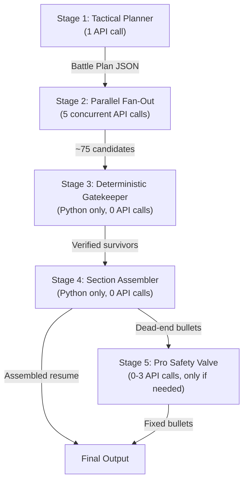

# 5-Stage Multi-Agent Tailoring Pipeline

Replace the current 2-agent pipeline with a 5-stage system: AI planning → parallel candidate generation → deterministic filtering → stateful assembly → AI escalation for edge cases.

## Architecture

## API Call Budget

| Stage | Calls | Model | Temp | Parallel? |
|-------|-------|-------|------|-----------|
| 1. Planner | 1 | gemini-2.0-flash | 0.3 | No |
| 2. Fan-Out | 5 | gemini-2.0-flash | 0.7 | **Yes** |
| 3. Gatekeeper | 0 | Python/regex | — | — |
| 4. Assembler | 0 | Python | — | — |
| 5. Safety Valve | 0-3 | gemini-2.5-pro | 0.4 | No |

**Total**: 6-9 calls per compile (vs. 2 currently). But Stage 2 runs in parallel, so wall-clock time is ~Stage 1 (3s) + Stage 2 (5s parallel) + Stage 3-4 (instant) + Stage 5 (0-8s if triggered) ≈ **8-16 seconds**.

## Proposed Changes

### Gemini Client

---

#### [MODIFY] [gemini.py](file:///Users/xalandames/Documents/SwampHacks%202026/restailor/backend/app/services/gemini.py)

- Add `model` parameter to `generate_json()` (default: `"gemini-2.0-flash"`)
- Add `generate_json_parallel()` function that runs N prompts concurrently via `asyncio.gather`, bypassing the per-request rate limiter but respecting a batch-level delay

---

### Tailoring Engine (Full Rewrite)

---

#### [MODIFY] [scoring.py](file:///Users/xalandames/Documents/SwampHacks%202026/restailor/backend/app/services/scoring.py)

Complete rewrite with 5 stages:

**Stage 1 — `_stage1_plan()`**: Tactical Planner
- Prompt maps each bullet to a strategic pillar + assigns a preferred starting verb
- Returns `BattlePlan`: `{bullet_id: {pillar, preferred_verb, tone_focus}}`

**Stage 2 — `_stage2_fanout()`**: Parallel Fan-Out
- 5 concurrent prompts, each with a different "verb bank" slice + tone directive
- Each prompt rewrites ALL bullets → produces 5 candidates per bullet
- Uses `generate_json_parallel()` to bypass sequential processing and run 5 calls at once.

**Stage 3 — `_stage3_gatekeeper()`**: Deterministic Gatekeeper (Python only)
- Forbidden verb check (regex on first word).
- Metric integrity: extract all numbers from original with regex, verify all present in candidate.
- Technical noun check: extract capitalized multi-word terms, verify preservation.
- Returns only survivors.

**Stage 4 — `_stage4_assembler()`**: Stateful Section Assembler (Python only)
- Iterate through sections in render order.
- For each bullet: pick highest-scoring survivor with unique starting verb for that section.
- **Gerund Budgeting**: Deterministically track the "Max 2" gerund limit across the page using regex (e.g., `r",\s+\w+ing\b"`). Filter out gerund patterns once the limit is reached.
- Flag "dead-end" bullets (0 survivors or verb clash) for Stage 5.

**Stage 5 — `_stage5_safety_valve()`**: Pro Safety Valve
- Only for flagged bullets.
- Sends: original text, `used_verbs` set, forbidden words list, pillar context.
- Uses `gemini-2.0-flash-thinking` or `gemini-1.5-pro` for high-reasoning rewrite.
- Returns single rewrite per bullet.

## Verification Plan

### Automated Tests
- Compile with test resume + JD, inspect console logs for all 5 stages
- Verify Stage 3 catches forbidden verbs and metric changes
- Verify Stage 4 produces section-level verb uniqueness
- Count gerund patterns in final output (should be ≤ 2)
